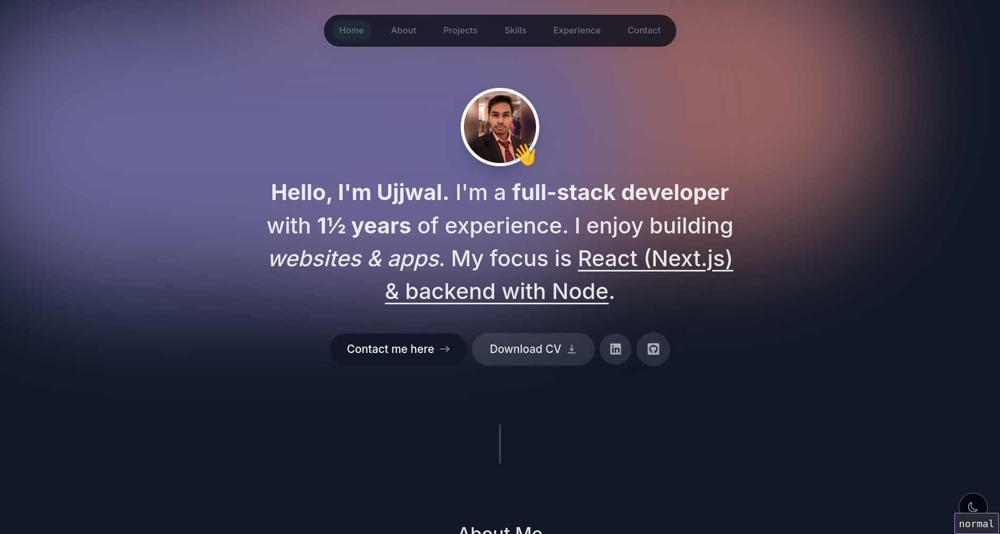

# Ujjwal Garg - Portfolio

  

## 🚀 Professional Summary

Innovative Software Engineer specializing in full-stack development with expertise in:

- Microservices architecture & cloud-native solutions
- High-performance application development
- Secure system design & implementation
- Machine learning integration

**Core Competencies:** Spring Boot • React/Next.js • AWS • Docker • CI/CD

## 🛠 Technical Arsenal

### **Programming Languages**

### **Web Technologies**

### **Cloud & DevOps**

## 💻 Highlighted Projects

### **Microservice Healthcare Platform** 

- Architected Spring Boot/Flask microservices with JWT security
- Developed ML-powered cancer prediction system (95-98% accuracy)
- **Tech Stack**: Spring Boot • PostgreSQL • Docker • Machine Learning

### **Enterprise School Management System**

- Handled 1200+ student records with AWS deployment
- Implemented type-safe APIs using tRPC
- **Tech Stack**: Next.js • Prisma • AWS EC2 • Microservices

### **Full-Stack Recipe Platform** 

- Developed secure CRUD application with NextAuth.js
- **Tech Stack**: Next.js • MongoDB • Material UI

## 🏆 Professional Journey

### **Backend Development Intern** @ Valsco Technology

- Optimized SEO for top 5 Google rankings
- Integrated payment gateways & web scraping systems

### **Technical Mentor** @ Ayna College

- Mentored 4,000+ students with 5-star rated support
- Provided technical guidance on full-stack development

## 📚 Education

**B.Tech in Information Technology**  
Vellore Institute of Technology (CGPA: 8.99/10)  
_2021-2025_

**Senior Secondary Education**  
Flora Dale School (94.4%)  
_2019-2021_

## 📜 Certifications

- Java Spring Boot Mastery Certification
- Next.js Advanced Development Certification
- AWS Cloud Practitioner Essentials

---

📫 **Let's Connect**:  

