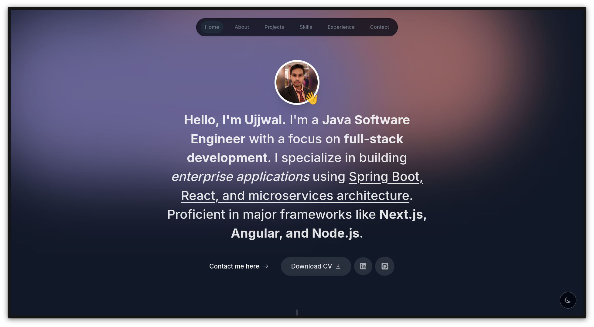

# Ujjwal Garg - Portfolio

  

## 🚀 Professional Summary

Full-stack Software Engineer with expertise in **Java/Spring Boot** and modern **JavaScript frameworks**, specializing in building secure, scalable services-based applications. Strong background in developing enterprise-level solutions with a focus on performance optimization and user experience. Combines analytical problem-solving abilities with collaborative skills to deliver high-impact software solutions across healthcare, education, and financial technologies.

**Core Competencies:**
Spring Boot • React/Next.js • Docker • CI/CD • REST APIs

---

## 🛠 Technical Proficiencies

### **Programming Languages**

### **Frameworks & Technologies**

### **Databases & Tools**

---

## 💻 Professional Projects

### **Cervix Cancer Predictor** 

- Architected scalable services using **Spring Boot** and **Flask** with domain-driven design.
- Developed **ML-powered cervical cancer prediction** system with secure patient-doctor communication.
- Implemented **JWT-based authentication** using Spring Security and features like real-time chat and medical-case management.
- **Tech Stack**: Spring Boot, Flask, PostgreSQL, Docker, Machine Learning.

### **Enterprise School Management System**

- Engineered platform handling **1200+ student records** with modular architecture.
- Implemented **type-safe APIs** using tRPC and features like Fee Management and Attendance Tracking.
- **Tech Stack**: Next.js, Prisma ORM, AWS EC2, TypeScript, MySQL.

### **Full-Stack Recipe Sharing Platform** 

- Developed scalable full-stack application with **CRUD operations** and secure authentication using NextAuth.js.
- **Tech Stack**: Next.js, MongoDB, Prisma, Material UI.

### **Cross-Platform Expense Tracker** 

- Created cross-platform mobile app with **Redux state management** and real-time Firebase synchronization.
- **Tech Stack**: React Native, Redux, Firebase, Expo.

---

## 🏆 Professional Experience

### **Backend Development Intern** @ Valsco Technology

_Aug 2023 – Sep 2023_

- Optimized website **SEO**, achieving **top 5 Google search ranking**.
- Executed **web scraping** using Puppeteer for database seeding.
- Integrated **third-party payment gateway** to enhance platform capabilities.

### **Technical Teaching Assistant** @ Ayna College

_Oct 2023 – Jan 2024_

- Mentored **4,000+ students**, providing technical guidance and doubt resolution.
- Maintained **5-star rating** through comprehensive support.

---

## 📚 Education

**Bachelor of Technology in Information Technology**
Vellore Institute of Technology
_CGPA: 8.96/10 • 2021 – 2025_

**Senior Secondary Education (CBSE XII)**
Flora Dale School
_Percentage: 94.4% • 2021_

**Higher Secondary Education (CBSE X)**
Flora Dale School
_Percentage: 93.8% • 2019_

---

## 📜 Certifications

- **Java Spring Boot 0 to 100**
- **Advanced Web Development Bootcamp**
- **Next.js 13 Advanced Techniques**

---

📫 **Let's Connect**:

